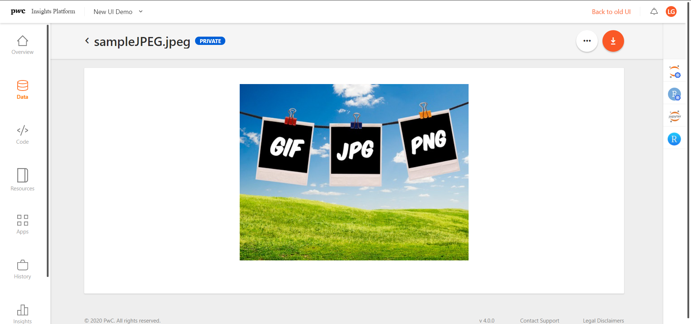

# Insights Platform v4.1 User Guide

**DRAFT: October 29, 2020**

## Table of Contents
<!-- TOC -->

- [Welcome to the Insights Platform User Guide](#welcome-to-the-insights-platform-user-guide)
  - [Who is this document for?](#who-is-this-document-for-)
- [Insights Platform Overview](#insights-platform-overview)
  - [Insights Platform Benefits](#insights-platform-benefits)
  - [How It Works](#how-it-works)
  - [Insights Platform Workflow](#insights-platform-workflow)
- [Using Insights Platform](#using-insights-platform)
  - [Getting Started](#getting-started)
  - [Accessing Insights Platform](#accessing-insights-platform)
    + [Password Recovery](#password-recovery)
  - [Tenant List Page](#tenant-list-page)
  - [Tenant Overview Page](#tenant-overview-page)
    + [User Profile settings](#user-profile-settings)
- [Ingest Data](#ingest-data)
  * [Before You Begin](#before-you-begin)
    + [Ingestion terms](#ingestion-terms)
    + [Ingest History](#ingest-history)
  * [Ingesting Data](#ingesting-data)
    + [Required inputs](#required-inputs)
  * [Local upload](#local-upload)
    + [Steps for Local upload](#steps-for-local-upload)
  * [Server transfer](#server-transfer)
    + [Steps for Server Transfer](#steps-for-server-transfer)
    + [Adding a SFTP connection](#adding-a-sftp-connection)
  * [Database migration](#database-migration)
    + [Steps for Database Migraton](#steps-for-database-migration)
- [Prepare Data](#prepare-data)
  * [Before you begin](#before-you-begin)
    + [Data preparation terms](#data-preparation-terms)
  * [Data Explorer](#data-explorer)
  * [Using Insights Platform’s data preview tool](#using-insights-platforms-data-preview-tool)
  * [Other data preparation tools](#other-data-preparation-tools)
  * [ADI](#adi)
    + [Accessing ADI](#accessing-adi)
    + [ADI Basic Concepts](#adi-basic-concepts)
    + [Building recipe plans](#building-recipe-plans)
      - [Recipes selection](#recipes-selection)
      - [Recipe categories](#recipe-categories)
    + [Cleaning recipes](#cleaning-recipes)
    + [Enhancement recipes](#enhancement-recipes)
    + [Enrichment recipes](#enrichment-recipes)
    + [Additional Outputs](#additional-outputs)
    + [Actions and views](#actions-and-views)
- [Model Data](#model-data)
  * [Before you begin](#before-you-begin)
    + [Modeling terms](#modeling-terms)
    + [Create Resources](#create-resources)
    + [Development Tools](#development-tools)
  * [Add a GitHub repository on Insights Platform](#add-a-github-repository-on-insights-platform)
  * [Build a Model in Jupyter](#build-a-model-in-jupyter)
  * [Specifying files to be ignored by Git (.gitignore)](#specifying-files-to-be-ignored-by-git--gitignore-)
  * [Upload resources](#upload-resources)
    + [Add resource from your computer](#add-resource-from-your-computer)
    + [Add resource from GitHub](#add-resource-from-github)
    + [View uploaded resource](#view-uploaded-resource)
  * [Create an App](#create-an-app)
  * [Run jobs](#run-jobs)
    + [Run Application (App) job](#run-application--app--job)
    + [Run Component Job](#run-component-job)
    + [Run script](#run-script)
    + [Status](#status)
- [Visualize Data](#visualize-data)
  * [Before you begin](#before-you-begin)
    + [Visualization terms](#visualization-terms)
  * [Design, build, and publish your dashboard](#design--build--and-publish-your-dashboard)
    + [Connect to data](#connect-to-data)
    + [Build reports](#build-reports)
    + [Publish](#publish)
    + [Link to Insights Platform](#link-to-insights-platform)
    + [Linking a Dashboard Created in Tableau](#linking-a-dashboard-created-in-tableau)
      - [How do I get my Tableau password?](#how-do-i-get-my-tableau-password-)
      - [Publish Tableau Workbooks](#publish-tableau-workbooks)
      - [Add a Visualization Link](#add-a-visualization-link)
      - [Authentication](#authentication)
      - [Launch Insights](#launch-insights)
      - [Customize Insights](#customize-insights)
      - [Edit a Visualization Link](#edit-a-visualization-link)

<!-- /TOC -->

# Welcome to the Insights Platform User Guide

PricewaterhouseCoopers, LLP (PwC) has combined proven "Big Data" technologies with sophisticated analytics and self-service visualizations to create Insights Platform, an enterprise-ready solution that generates insights and delivers impact to business.

This user guide was developed to offer high-level guidance for Insights Platform. It also provides context and other foundational information necessary to understand the platform’s full potential and how it can be used to meet the complicated business challenges of PwC customers. 

Use it to help discover the capabilities and benefits of Insights Platform and to get a general overview of the platform’s distinct components. Learn how those components fit together to provide businesses with deep insights and solutions to difficult challenges that cannot be achieved through typical data analysis.

## Who is this document for?

  1) **Internal PwC engagement teams** so that they have a full appreciation for the platform’s power and dynamism, and enough of an understanding of its capabilities to recognize the many ways in which it can be used to meet their customers’ challenges.  
  2) **External PwC users** to gain an understanding of how the platform works, how it might help them make informed business decisions, and what resources would be needed to take full advantage of the many benefits it has to offer.

# Insights Platform Overview

One of the biggest challenges facing businesses today is the ability to move fast enough. Decisions need to be made quickly, but often the data needed to inform those decisions is not accessible. It resides in multiple sources and formats and consolidating it can take a good deal of time, effort, and manual manipulation. Once the data is available, the tools required to turn data into decisions are too slow, too complicated, or too expensive.

Insights Platform makes sense of messy data. It offers access to advanced analytic tools and techniques and integrates with existing IT architecture and workflows. The result is faster, deeper, and more actionable insights that impact businesses in a measurable and ongoing way.

Insights Platform offers the following capabilities:
  1) Real-time streams and batch data integration of structured, unstructured, and IOT data
  2) Data management tools for discovery, cleaning, blending, lineage, and metadata management
  3) Support for all major analytical programming languages and commonly used data science tools
  4) Assembly of data and analytical services into workflows that are integrated into corporate workflows and applications
  5) Visualization integration with Tableau Software, Microsoft Power-BI, Qlik, and custom HTML5 applications
  6) Platform infrastructure, including encryption, control, validation, and audit paths
  7) Support and administration for configurations and modular set up

## Insight Platform Benefits

Insights Platform helps users:
 - **Organize their data** - Ingest data from multiple sources, preprocess, clean and standardize the data, and visualize data with dashboards and APIs
 - **Establish or upgrade reporting** - Build repeatable data pipelines to report data, create reports with powerful visualization tools or build custom dashboards
 - **Predict needed action** - Use data science tools to create predictive models and integrate models into existing workflows to predict needed action
 - **Make data-driven decisions** - Leverage AI and machine learning coupled with automated simulation to choose the best probable outcomes

## How It Works

Insights Platform is industry agnostic. Any business that has data it wants to turn into actionable insights can benefit from using at least some of Insights Platform. These examples from across different industries illustrate some of the challenges the platform has already met and solved.

**Consolidate, clean up, and organize data for analytics**

**Retain and grow customers using advanced analytics**

**Build real-time business intelligence to drive decisions**

## Insights Platform Workflow

Insights Platform workflows break down into four broad phases:

Within each of these phases is the collection of sophisticated tools and techniques—PwC proprietary data models, data science technologies, analytic services, pre-packaged visualizations—that makes the platform flexible, dynamic, and quickly deployable.

# Using Insights Platform

This guide introduces you to the Insights interface and addresses each of the four main workflow phases. It presents the available range of tools and features within each phase and describes how they fit together to make up Insights Platform.

## Getting Started

Before you begin, make sure you have these resources available.

1) Google Chrome: Insights Platform is not compatible with Firefox or Safari. The required browser is Google Chrome.
2) User account: You must have a user account to log in to Insights Platform. Your system or tenant administrator will allocate a user account to you and provide login credentials (unless single sign-on has been enabled for your organization).

## Accessing Insights Platform

When the system or tenant administrator has created a new user account, an email is sent with details of accessing the Insights Platform. This email contains the URL of the Insights Platform, the username and the tenants for which the user has access. A temporary password valid for 24 hours is also sent through a separate email.

You can launch the Insights Platform from the url in any web browser and login with the credentials shared with you. First time users will be prompted to change their passwords.

External users are required to complete multifactor authentication by providing a secure code that is valid for 5 minutes sent to the registered email ID for every login. They need to complete the Captcha challenge as well (Recaptcha v2).

### Password Recovery

In case you forget your password, you can choose the *Forget Password* link in the login page. This takes you to a Password Recovery screen where you need to provide the registered email and complete a Captcha challenge. Instructions to reset the password will be sent via email. 

## Tenant List Page

When you login to Insights, the default landing page is the tenant list displayed as workspace tiles. Click the tenant tile you want to work with. You can shift between the tile and list view depending on your preferences, resort your tenants, search for a specific tenant, or tag your “favorite” tenant(s) to keep them at the top of your list  

**Note:** If you’re only assigned to one tenant, Insights Platform will open you tenant directly in the **Overview page**. 

## Tenant Overview Page

The Tenant Overview page is divided into three main sections:

  1) The Navigation bar quickly takes you to the different pages of the tenant. 
  2) In the center section, the *Tenant Links* card is a convenient place to store links to dos slides and other important links related to this tenant. The *Users* card shows the total number of users, plus the active and new users for the tenant. The *Datasets* card displays the number and types of datasets ingested into the tenant. 
  3) The *Recent Activity* card shows all the activity that’s happened in the tenant and lets you filter by type of activity and data range.

### User Profile settings

You can view and adjust you Profile settings by clicking your Profile Avatar in the upper right and choosing **My Profile**. There are four tabs: 

1)	**Details** displays your name, email and role on the tenant. None of these fields can be changed here.
2)	**Tableau** allows you to save your user credentials if you are using Tableau which can be used to open your Tableau dashboard from the *Insights* page. **Note:** Only Tableau credentials need to be saved in your profile. Other tools like Power BI and Qlik use SSO. 
3)	**Notifications** lets you turn on email notifications for the status of the jobs you run. There are different statuses: Initialized, Failed, Success. Notifications are  off by default. **Note:** Once you change this option, it will be reflected across all Tenants to which you’re assigned. 
4) **Git profile** shows the profiles already associated to the user, you can manage your git profiles or add a new one.

# Ingest Data

One of Insight Platform's most dynamic features is its ability to adjust to almost any type of data a customer wishes to analyze. It can take in many different data formats through multiple channels and turn that collected data into accessible reports and tools that shape business decisions and predict future trends. 

This section will guide you through the steps for ingesting data through three different channels:
  1) Local upload
  2) Server upload
  3) Database migration

The following file types can be ingested into Insights: 

## Before You Begin

Before you bring data into Insights, be sure you have the team, the resources, and information you need to be successful.
 - **Data Engineer**: The data ingestion phase of Insights Platform requires an understanding of data source and data type. Have someone with data engineering skills available as a resource.
 - **Data Source**: How and where your data is stored will determine the best method for ingesting it. Know the source and the format of your data.
 - **Data Storage Path**: Know the storage (WASB or HDFS), and the destination on the Hadoop Distributed File System (HDFS) where you want to upload and store your data.
 - **Structured Data**: If your data is unstructured, contact your administrator for help in transforming your files into structured data.

### Ingestion terms

The following terms are used throughout the ingestion process:
 - **Data Parsing:** Partitioning data into smaller chunks by following a set of rules, so that it can be more easily interpreted, managed, or transmitted. Enabling data parsing on Insights Platform allows you to create parquet and hive files from the uploaded data.
 - **Delimiter:** In data parsing, the delimiter separates data fields and defines columns for your data. A CSV file uses commas as a delimiter. Where applicable, other delimiters are available for your selection from a drop-down menu on the Ingest data form.
 - **Enclosure:** In data parsing, the enclosure defines the contents of a data cell. It occurs at the beginning and the end of the cell. The enclosure contains a delimiter as defined in the delimiter field. Where applicable, the application’s enclosures are available for your selection from a drop-down menu.
 - **Hadoop:** Hadoop is an open source, Java-based distributed processing framework that manages data processing and storage for big data applications running in clustered systems. For Insights Platform, the Hadoop destination file path takes you to the location on the HDFS where you want to upload and store your data for fast retrieval.
In creating your file path, allowed special characters are " / " (slash) and “ _ ” (underscore). The name of the file path must begin with “ / “.
 - **WASB:** Windows Azure Storage Blob (WASB) is an extension built on top of the HDFS APIs. The WASB variation uses SSL certificates for improved security. It in many ways "is" HDFS. However, WASB creates a layer of abstraction that enables separation of storage. This separation is what enables your data to persist even when no clusters currently exist and enables multiple clusters plus other applications to access a single piece of data all at the same time. This increases functionality and flexibility while reducing costs and reducing the time from question to insight.

### Ingest History

Check the status of ingested data by clicking the *History* from the left menu, and selecting *Ingest* from the first filter. Uploads are ordered by the *Initiated* date and time. Statuses can be Completed, In-progress, or Failed.  

## Ingesting Data

To ingest data into Insights Platform:
  1) Click **Data** in the left navigation menu
  2) Click **+** and select **Add Data** option. The Ingest Data screen appears.

There are three tabs at the top for the three different types of uploads, or channels. The default screen is Local upload. The source of your data and the channel you use determine the steps you’ll follow to ingest new data into the Platform. When you’re ready to ingest data, click the tab option for the channel you’d like to use.

Return to the *Data* screen from any point by clicking **Data** in the left navigation bar, or by clicking **<** beside **Ingest data**.

### Required inputs

Each of the channels has a different Ingest data screen with different fields, entries, and drop-down menus. A minimum amount of information is required for each to perform the ingestion. Required fields are noted with a red asterisk.

## Local upload

A vast amount of information resides on shared drives, like Google Drive, or on private drives, like your computer. Local upload allows you to move that data to Insights Platform and make it available for modeling, analysis, and visualization.

Local upload is best for small files defined as less than 100 MB. The platform can support a local upload as large as 2 GB; however, the risk of dropped connections and other interruptions make ingesting large files from local sources more challenging. For files of that size, contact your administrator for help. 

Local upload is also recommended for frequent data imports, or periodic batch jobs to onboard data. Besides Local upload, you can use an automated process that writes to the platform SSH File Transfer Protocol (SFTP), or a platform API, which is not recommended for large files.

### Steps for Local upload

  1) Select Files: Drag and drop a file to the Upload Source field or click choose your file to select the file you want from your drive. Metadata should be included in the file you want to ingest. The application will recognize it. Note: The optional Metadata file feature is not currently functional.
  2) Parse Data: Click the Data parsing toggle to display additional drop-down menus. Select Retain both files to save both your source file and parsed file. By default, this checkbox is selected (both files will be saved), but if you want to keep only parsed file, uncheck the box. Use the menus to select a delimiter and enclosure.
  3) Select File storage: Select the target storage you would like to upload the file to - HDFS or WASB. Note: Data parsing is not yet available for WASB storage.
  4) Select File path: Type the path of the location where you want to upload and store your data for fast retrieval. Click Select path to display the Select path popup. Select the folder where you want to put your file and click the button to return to the Ingest data form. Note: Currently Select Path is available for HDFS storage only.
  5) Upload Data: Click Upload to begin the ingestion process. A progress bar will display the progress of your upload. When complete, an upload confirmation message will appear in the upper right corner of the screen.

## Server transfer

Server transfer allows you to transfer data from files uploaded or from a predefined SFTP location, to the Insights platform, and make it available for modeling, analysis, and visualization. This channel is best for files larger than 100 MB and for periodic exports. SFTP locations can be set up by System Admin user.

### Steps for Server Transfer

  1) Select data source: Under Transfer from select either Insights Storage or Another Server. Note: Insights Storage is set up and integrated with the platform during implementation; Another server may provide connection to multiple servers, which are configured by System Admin by adding connection details.
  2) Select files: For Insights Storage, click in the Select Files to Transfer field to display the Select files popup. Select the file(s) you want and click Select to return to the Ingest data form. Click in the Select Files to Transfer field if you want to open the Select files popup again to choose more files. For Another server, click the Select Connection drop-down to choose a SFTP connection first. Then click in the Select Files to Transfer field to display the Select files popup and choose your files.
  3) Parse data: Enable the Data parsing toggle to display additional drop-down menus. Select the Retain both files checkbox to save both your source file and parsed file. Note: This checkbox is selected by default (both files will be saved), but if you want to keep only the parsed file, uncheck it. Use the menus to select a delimiter and enclosure. Note: Data parsing is currently not available for WASB.
  4) Select file storage: Select the target storage you would like to upload the file to - HDFS or WASB. Note: Data parsing is not yet available for WASB storage.
  5) Select file path: Type the path of the location where you want to upload and store your data for fast retrieval. Click Select path to display the Select path popup. Select the folder where you want to put your file and click the button to return to the Ingest data form. Note: Currently Select Path is available for HDFS storage only.
  6) Upload data: Click Upload to begin the ingestion process. A progress bar will display the progress of your upload. When complete, an upload confirmation message will appear in the upper right corner of the screen.

### Adding a SFTP connection
You can add additional SFTP connections by clicking **Add Connection**. 

This will open the **Add Connection** modal to enter the new SFTP connection details.

After entering the server information, click **Test** to check if the connection was established. After you save your new connection, you’ll be able to select it from Select Connection dropdown, edit it, or remove it.

Please note that the platform supports password-based as well as private key-based authentication depending on how the SFTP server is configured

## Database migration

Database Migration allows you to migrate the database from a specified source into a target storage within the platform’s file system.

### Steps for Database Migration

  1) Fill in source database credentials: Enter source Server Name, Database Name, Username and Password. Get Schema List will become enabled.
  2) Get schema list: Click Get Schema List and the schema list will be loaded into the Schema Table List select box.
  3) Select tables for migration: From the “Schema table list” select box, select specific tables to migrate, or select all to migrate the whole database.
  4) Select file storage: From the Schema Table List, select specific tables to migrate, or select all to migrate the entire database.
  5) Select file path: Type the path of the location where you want to upload and store your data for fast retrieval. Click Select path to display the Select path popup. Select the folder where you want to put your file and click the button to return to the Ingest data form. Note: Currently Select Path is available for HDFS storage only.
  6) Commit process: Click Commit Process to begin the database migration. A confirmation message about the successful start will appear in the upper right-hand corner of the screen.

To see the status of the database migration process, click History in the main navigation menu. 

# Prepare Data

**Clean and profile data with engineering tools**

Once ingestion is complete, you're ready to explore and clean your data through data preparation. There are a number of adaptive engineering techniques and engines that you can use to simplify and expedite the preparation of your data. Insights Platform provides an advanced data prep tool that you can access from within the platform. You can open your ingested files directly into this point-and-click tool where you can then use machine learning-based smart guides and visual discovery to quickly identify and correct errors.

This section will guide you through the steps for finding your file and using the Insights Platform data prep tool to explore and clean your data to prepare it for the modeling phase. Additional data preparation tools are listed at the end of the section.

## Before you begin

Before you start data preparation, be sure you have the team, the resources, and the information you need to complete the task successfully.
  1) **Data Preparation Tool**: You have the option to use a range of different techniques and tools to clean your data. Know which one will work best with your data and make sure you have access.
  2) **Data Engineer**: The data preparation phase of Insights Platform requires an understanding of data types and expected ranges, and the ability to recognize and resolve potential data issues. Depending on the tools you select, you will need someone with the specific technical skills to navigate and apply those tools. Have someone with the appropriate level of technical knowledge and skill available as a resource.

### Data preparation terms

The following terms are used throughout the data preparation process:

**Dataset:** A dataset is the raw data that you are cleaning and transforming by applying preparations. It presents as columns and rows. With Insights Platform’s data prep tool, you can adjust and clean the data in your dataset by applying one or more preparations and recipe steps without altering the original data.
**Function:** A function is an action that you apply to your data. It can be applied to a row, a column, or the whole table. Examples are removing rows, standardizing a date format, or deleting duplicate values. As you apply functions to make the changes you need to clean up your data, they are recorded into recipes. Applied functions do not modify the original data.
**Recipe:** In data preparation, a series of functions combined into one set of instructions is a recipe. Recipes are applied to a dataset to create a preparation. With Insights Platform’s data prep tool, the recipe is the top-down sequence of functions recorded in the collapsible panel on the left side of the screen. Changes you make to a recipe are automatically saved in the preparation in real time.
**Preparation:** A preparation is the final outcome that you want to achieve with your data. It takes one dataset and applies a recipe to produce an outcome. You can export and save this outcome as a file without ever modifying the original dataset.

## Data Explorer

To begin data preparation, you first need to find the ingested file you want to prepare using the Data explorer. This screen offers navigation tools to help you in your search.

The first way to find your file is to go directly to the *Data* page, using by clicking **Data** in the left navigation menu. Look in the first column for the folder where you stored your file. Your ingested file will appear in the folder as a parquet file. Click it and Insights Platform’s data prep tool will open.

A folder labeled *Exception* indicates  there was an issue during the parsing of your data in the ingestion phase. Use the information in the folder to investigate the source of the issue. The icon labeled *Copy path* is where you'll find the file path of your file.

There are different actions you can perform using file's context menu:

1. Open in ADI (HDFS/WASB)
2. View data profile (HDFS/WASB)
3. Download file (HDFS/WASB)
4. Delete file (HDFS/WASB)
5. Rename file (HDFS)
6. Copy path (HDFS)

You can also find your files by searching in the *Ingest history* page, accessed by clicking **History** in the left hand navigation menu. The icon labeled *File Path* is where you will find a link to the location of you file.

There are many different approaches to data preparation, including an array of tools and applications. The exact features available to you and the steps you will take to apply them will depend on the tool you select. This section describes the steps you would follow to use Insight Platform’s embedded data preparation tool.

## Using Insights Platform’s data preview tool

You can get a quick overview of your dataset. Most of the files in following file types can be easily previewed by clicking the file name:
  1) CSV
  2) PARQUET
  3) TXT
  4) JPEG/JPG
  5) PNG
  6) GIF

Please note that this is only a quick preview, for parquet and csv, it’s showing the sample data based on the top 1000 rows of your file.

## Other data preparation tools

There are other data preparation tools you might utilize such as:
  1) Python
  2) R
  3) ADI
  4) Pentaho Jobs

## ADI

Automated Data Intelligence (ADI) is another tool available on Insights Platform for analyzing and preparing data. Similar to the Insights data preparation tool, it offers a range of features to help you cleanse and transform your data by changing formats, aggregating, extracting patterns, and manipulating rows and columns. It also allows you to combine information from different datasets. 

ADI will analyze your data and suggest appropriate data transformation operations to apply. Like the Insights data preparation tool, it allows you to select and sequence your steps and save them as recipes. ADI is tenant-specific. Contact your tenant administrator to enable using ADI.

### Accessing ADI

To use ADI, you must first find the ingested file with the data you want to prepare. ADI can be used with csv (comma-separated values) and parquet file formats. For these two file formats, ADI is available from the Data Explorer menu.

To access ADI:
  1) Navigate to the Data Explorer
  2) Click the three vertical dots in the Actions column to display the drop-down menu.
  3) Select **Open in ADI** from the drop-down menu.

### ADI Basic Concepts

When you open a parquet or csv formatted dataset in ADI, a preview of your data will display in a table as shown in the following figure.

If the dataset is already being processed and you try to access it using the ADI option, a message displays that states that the data registration is in process. Once the dataset has been registered, you can open the preview in ADI using the option mentioned above.

#### Column profiles

ADI automatically detects the data type in each column and generates a statistical profile based on the type of data. The profiles display at the top of each column. The type of profile depends on the data in the column. Examples of each type of profile are shown in the following figures for the Histogram, Top Values, and Uniqueness.

  * **Histograms:** For columns with numbers or dates, the data is displayed as a histogram.
  * **Top Values:** For columns with discrete values, the most common values are displayed as "Top Values" as a percentage of the whole.
  * **Uniqueness:** For columns that can be considered as the primary key of the dataset (individually or combined with other columns), a uniqueness percentage displays.

#### Drill-down feature

You can drill down into any of the profiling views to see more detail by clicking the minimized profiling information. The following figure is a detailed view of the Longitude column from the above preview table. To exit, click "X" in the upper right corner of the screen.

The following example shows a dataset with a small percentage of uniqueness.

 This is an example of a dataset column profile with Top Values detail.
 

Under the preview table, statistical information regarding the full dataset is displayed, including Number of rows, number of columns as well as the number of rows and strategy associated to the preview.

#### Process status log

You can check the status of any process in the same tenant by clicking the status icon in the top right corner of the screen. A screen displays with information about what processes ADI executed.

#### Process types

ADI has three different types of processes called out in the following figure:

  * **Dataset Registration:** The operation performed to register a dataset at ADI.
  * **Run enrichment:** The execution of a complete dataset transformation and the generation of a new one.
  * **Run recommendation:** The execution of an enrichment of previously defined data on the information.
  * **Test enrichment:** The execution of a set of transformations on a dataset preview that shows you how the dataset will change as a result of the transformation process.

Click any individual listed process to see more detail. The status feature allows you to review each phase of a process, see how much time has elapsed for each step, and access detailed internal logs.

Using the kill button under process details table, processes execution can be cancelled. This button will be available only for those processes in status running.

### Building recipe plans

#### Recipes selection

1) Click **Enrich>** from the main ADI screen to display the *Choose Recipes* screen where you can begin to build your recipe plan. You'll find recipes to choose from at the left side of the screen, as shown in the following example:

There are instruction in the middle of the page on how to add recipes. Look in the recipes catalog from the list, by searching key words, or even by category in the drop-down list.

#### Recipe categories

There are many recipes available to apply to a dataset. ADI categorizes them as follows.

 - Suggestions: ADI can recommend recipes for a dataset.
 - Cleaning: A set of recipes for fixing problems found in the original dataset using different strategies. 
 - Enhancement: Recipes that can be applied to generate additional columns automatically by processing information from other columns of the same dataset.
 - Enrichment: Recipes that can be applied to create new columns or combine information from different data sources.
 - Additional Outputs: Recipes that change the input scheme currently block adding more recipes. We can use some recipes and continue with my main broadcast channel, without being affected by those recipes.
 - Data quality: This set of recipes allow users to create business rules and then perform different actions for those rows that fit the rules, and those who don't fit the rules. Rules can be applied at row level, or at dataset level.

Additionally, through the Users Guide option, we can display a contextual help of all the recipes available. The helpers for recipes are also available by clicking on a recipe's description.

  1) Select the **+** button next to each recipe name you want to add to your plan and it will be included in the pipeline.
  2) Scroll down to see all the recipes you added.
  3) To manage your recipes, use the eye and recycle (trash bin) icons  in the top-right side of the recipe you added to your pipeline.

The following section shows the various recipes available in the platform:

### Cleaning recipes
Cleaning recipes let you fix problems in datasets including removing duplicate rows, managing null and outlier values, and managing columns and rows.

##### Change column data type

##### Fills null with column

##### Fill null with metric

##### Fills null with value

##### Filter tables

##### Impute Dates

##### Remove Duplicate Rows

##### Remove null rows

##### Remove or Detect Outliers

### Enhancement recipes
Enhancement recipes let you automatically generate additional columns using data bucketing, dropping and adding columns, and a wide variety of options to manage information.

##### Concat a Column with Literals

##### Concat Columns

##### Contextualize with aggregates

##### Count encoding

##### Create a new column with conditional content

##### Create date field

##### Custom Code

##### Data Bucketing

##### Drop Null Columns

##### Drop or Select Columns

##### Extract data with RegExp

##### Extract Value from JSON Column

##### Fx Conversion

##### Geographical Distance

##### Map Columns

##### Normalization

##### One hot encoding

##### Rank Rows

##### Reduce precision

##### Sensitive data encryption

##### Softlongtail

##### Splits a date field into atomic values

##### Target encoding

##### Union

### Enrichment recipes
Enrichment recipes provide you with options to enrich your dataset by joining it with a master dataset, and to extend your datasets information by adding new columns from another dataset.

##### Enrichment and harmonization

##### Fuzzy Match

##### Join

### Additional Outputs
Recipes that change the input scheme currently block adding more recipes. We can use the pivot column or summarize data recipes and continue with my main broadcast channel, without being affected by those recipes.

##### Pivot Column

##### Summarize Data

### Actions and views
While building your recipe plan, you have several different actions and views to work with. Use the icons located on the top right side of the screen to manage your recipes.

 - **Export recipes:** Use this feature to export the recipe plan I have added. The export will be done to a plain text file with the JSON resulting from the ADI Engine orchestrator.
 - **Save recipes plan:** Use this feature to store the list of selected recipes associated with the dataset (with parametrization).
 - **Load recipes plan:** Opens previously stored recipes plans for the selected dataset.
 - **Delete recipes plan:** Lets you delete a recipe plan.
 - **Test recipes plan:** Executes the selected recipes on a small sampling of the original dataset to preview the results.
 - **View 1:** This is the view selected by default, with a list of recipes available on the left, and a list of selected recipes on the right.
 - **View 2:** This view shows in a graphic way how a recipe transforms a dataset, dropping columns, adding new columns, or updating existing columns. The following figure shows an example.
 - **View 3:** Displays a table with the selected recipes applied to the dataset preview.

Once a recipe plan is complete, you can name the new dataset that will be created after the plan is applied. The new dataset will be saved with the name you provide. The original dataset will remain in the same source folder.

We can also send extra parameters that allow us to define variables related to WASB.

1) When you select **Run ADI**, the Process Status screen displays.

2) Select the **Process Name** and **Process type** to view the progress tracker. The tracker displays a green path showing the Started, Ended, and Elapsed time for each part of the process. Green check marks indicate the process has completed.

As soon as the process is completed, you can view the output dataset in the data explorer. Once you have completed the data preparation phase using the tools of your choice, you are ready to move on to modeling.

# Model Data

**Use advanced analytics to discover patterns and make predictions**

Once you have ingested and prepared your data, you're ready to analyze it and turn it into actionable insights. You do this by using data science tools and Insights Platform’s highly scalable environment to build predictive models and integrate them with existing workflows to identify patterns, opportunities, and needed actions. You can also leverage machine learning coupled with artificial simulation to choose the best probable outcomes and prescribe actions accordingly.

There are several parts to the modeling phase. The section will guide you through the following steps for developing and using your models:
  1) Create Resources
  2) Upload Resources
  3) Create Apps
  4) Assign apps/users
  5) Run Jobs & View run history

## Before you begin

Before you begin modeling, be sure you have the team, the resources, and the information you need to complete the task successfully. The modeling phase of Insights Platform requires an understanding of multiple modeling, distributed processing, and machine learning tools:
  1) Integrated data science development tools such as JupyterLab, RStudio, Pentaho, Spark, and Talend ETL and Data Prep Jobs
  2) Git version control
  3) Relational SQL Databases, HDFS and columnar data formats like parquet
  4) Distributed in-memory data processing tools, such as Apache Spark
  5) Custom Python/R algorithms
  6) Standard analytics models for business use cases such as Churn and CLV

Depending on the tools you select, you'll need someone with the specific technical skills to navigate and apply those tools. Have someone with the appropriate level of technical knowledge and skill available as a resource. 

Data is stored in WASB and SQL servers provisioned for the client. The connection string is specified in jobs and code. All Data is retained under the terms of the contract. No data is ever purged unless the client or engagement team deletes it. 

### Modeling terms

 - **Resource** Resources are the scripts, programs, and code that you develop using the modeling, distributed processing, and machine learning tools listed above. Resources can be executed individually or bundled into apps.
 - **App:** Apps are bundles of resources that you combine to achieve your desired outcome with the data you have uploaded. Resources are combined into workflows with execution orders that determine whether they are executed in parallel or sequentially.
 - **Component:** A component is one of the four phases of Insights Platform workflow. Those four phases are Data Ingestion, Preparation, Modeling, and Visualization. Resources can be attached to single or multiple components. Apps can be run against single or multiple components.
 - **Repository (Repo):** A repository is like a folder for your project. Your project's repository contains all of your project's files and stores each file's revision history.

### Create Resources

Models you create are recognized by Insights Platform as *Resources*. There are many tools that will work with Insights Platform to create resources, but the primary tools are Jupyter, RStudio, Spark and Pentaho. Jupyter and RStudio are currently integrated into the platform. Spark and Pentaho jobs can be developed on the desktop app and imported to the platform.

### Development Tools
Insights Platform provides the following development tools for development. All are accessible from the right sidebar from all pages (except *Overview*). 
 - **JupyterLab**:  A web-based user interface that enables you to work with documents and activities, such as Jupyter notebooks, text editors, terminals, and custom components in a flexible, integrated, and extensible manner. You can arrange multiple documents and activities side by side in the work area using tabs and splitters. Documents and activities integrate with each other, enabling new workflows for interactive computing.
 - **RStudio** (containerized):  An integrated development environment (IDE) for R. It includes a console, syntax-highlighting editor that supports direct code execution, as well as tools for plotting, history, debugging, and workspace management. 
 - **JupyterHub**: A standalone version of Jupyter, it'll open in a separate tab.
 - **RStudio** (standalone): A standalone version of RStudio, it'll open in a separate tab, and requires username/password to sign in.

## Add a GitHub repository on Insights Platform

To begin modeling, add a GitHub repository (repo) on Insights Platform. Models are developed in GitHub repositories that are created on or associated with the Platform. These repos can be created through one of the development tools.

The system currently supports private non enterprise and public/private enterprise Github repos. As long as the github token is valid, the user will be able to create a repo within Insights platform.

A user specific git profile need to be setup prior to creating a github repo within the platform. To do so , select a tenant and click on the user profile as shown below.

This will open up a panel on which Git Profiles section need to be selected. This would show the profiles already associated to the user.

Click on Add Profile and enter the details such a user defined profile name, the access token and the github domain where the repositories are hosted and click on Done.

Click **Code** in the left navigation menu. The last repo that was used will appear. 

Click **+** in the upper right of the screen, the **Add repo** menu displays. 

The following table lists the definitions of the fields: 

<table>
  <tr>
    <td>Name</td>
    <td>Name your repository.</td>
  </tr>
  <tr>
    <td>Repo type</td>
    <td>Choose whether to create a local repo or link the new repo to GitHub</td>
  </tr>
   <tr>
    <td>Token
(for Git repo only)</td>
    <td>Select a profile which was created in "Git profile" tab.</td>
  </tr>
  <tr>
    <td>Repository
(for Git repo only)</td>
    <td>The github repo name. This is a dropdown which will list all the github repos accessible by the token associated to the profile previously created. Users can scroll down to the desired repo or type in the repo name in the text box and press enter which will return all the matching repos.
  </tr>
  <tr>
    <td>Branch
(for Git repo only)</td>
    <td>Select a branch from the drop-down list.</td>
  </tr>
  <tr>
    <td>Description</td>
    <td>Add an optional description as necessary.</td>
  </tr>
</table>

Input necessary information and click **ADD**.

You can change repos by clicking the  icon after the repo name, and selecting a different branch.

## Build a Model in Jupyter

The following is an example of building a model in Jupyter. The process is similar for the other development tools. 

In the *Code* screen, select a repo and a branch, then click *JupyterLab* in the right sidebar.

 The *Launcher* screen will open. Select a launcher from the window on the right.

A new screen opens in the same tab or in a new tab. This is where you will build or upload your model. Your screen will look different depending on which tool you use. The screen below is for JupyterLab. 
Folders, files, and scripts display in the panel on the left side of the screen along with four vertical icons which provide commands to manage the content that you create in the tabs on the right.

**File browser:** File browser is the default panel and has four associated icons across the top:
 - New launcher
 - Upload files
 - New folder
 - Refresh file list
**Running terminals and kernels:** Displays a list of terminal and kernel sessions in the panel.
**Commands:** Displays a list of available commands grouped into categories, such as Console, File Operations, Kernel Operations, Image Viewer, and settings for how you want your screen displayed. There’s also a contextual help section which opens a new tab where you can view help for any of the active topics in the panel.
**Notebook tools:** Displays Slide Type, Raw NBConvert Format, and Advanced Tools that include Cell Metadata and Notebook Metadata.
**Open tabs:** shows a list of tabs open in the window on the right of your screen.

The right side of the screen is a set of tabs. Use the tabs to edit multiple files.

**Save:** Save the notebook content and create checkpoints.
**Insert:** Insert a cell below.
**Cut:** Cut the selected cells.
**Copy:** Copy the selected cells.
**Paste:** Paste cells from the clipboard.
**Run:** Run the selected cells and advance.
**Interrupt:** Interrupt the kernel.**
**Restart:** Restart the kernel.

There's also a drop-down menu where you can select Code, Markdown, or Raw.

1) Create your model in the workspace provided in the tab(s).

2) Once your model is complete and functional, you're ready to onboard it as a resource to Insights Platform. The first step in onboarding is to push it to GitHub by clicking the Push button at the top right corner of the screen.

3) A *Push changes* menu will display. Select what you want to push from the list offered. The platform will tell you how many scripts were created, changed, or deleted.

4) You can now import your model from GitHub and upload it as a resource. To import a Github model as a resource, click the **Import as resource** icon.

 

A slider will display, with all available models in the repo. Choose your model and click **Add Details** button.

 

Input detailed information of your model, click **Save** to save it as a resource, or click **Save & Add Package** to save it and add package.

 

## Specifying files to be ignored by Git (.gitignore)

Untracked files that Git should intentionally ignore can be specified through a .gitignore file. Files already tracked by Git are not affected; see the [Online Reference](https://git-scm.com/docs/gitignore) for details.

This section explains how to use the .gitignore file from the development tools on Insights Platform. It uses JupyterLab as an example, but the process is the same for R Studio.

1) Launch JupyterLab, from the right sidebar of the *Code* page.

2) On the JupyterLab Launcher pane, click **Terminal**
 

3) The JupyterLab terminal is launched.
 

4) You can use standard Unix shell commands here like listing files with **ls -ltra** and using vi editor to create/edit the .gitignore file.
 

5) The "PATTERN FORMAT" section of the [Online Reference](https://git-scm.com/docs/gitignore) provides further details on how the files to be ignored are to be specified in the .gitignore file.

6) The .gitignore file may also be pushed to GitHub by clicking *Push* icon at the top right corner of the screen.

## Upload resources

Resources are uploaded by Technical or Admin users with the following steps:
  1) Click the **Resources** icon from the left menu. A list of resources that have already been added will be displayed. Use the *Search* box above the table on the right to find a specific Resource.
  2) Click the **+** in upper right of the screen.

There are two ways to upload resources to Insights Platform: 
 - Add from your computer
 - Add from Github

### Add resource from your computer

After you click the *Add resource* icon, the *Add new resource* sidebar will display. 

Select **From your Computer** option, and click **NEXT** to move to the next step.

Browse to select a file from your computer. 

Edit the resource details (e.g. name, type, tags, description), and then save the resource or save & add packages. You will return to the Resources page where your new resource will be listed.

### Add resource from GitHub

After you click the *Add resource* icon, the *Add new resource* sidebar displays. Select **From Github**, and click **NEXT** to move to the next step. You can select a Git repo, and files in the Git repo will be listed. Then you can select a file to upload, click **Add details** to go to next step. 

Fill in the required fields, then click **Save & add package** to edit the configuration, or click **Save** to skip the configuration.

 - **Select file from Git Repo:** A Repo drop-down menu will display. Use it to select the repo from where you want to upload your resource.
 - **File:** A list of files in the repo will be available for select. Click to choose the resource you want to upload.
 - **Resource type:** Select the tool used to develop the resource from the drop-down menu. Options are: Pentaho, R, Python and Spark. Additional information might be required, depending on which type of resource you select (For example, Spark version or Python container type).
 - **Resource name:** The Platform will fill in the field using the name of the file you selected to upload. You can change the name here. This is how the resource will be listed on the Resource tab.
 - **Select applicable components:** Select one or more of Insights Platform components that your resource applies to.
 - **Resource description:** Add an optional description as necessary.

If you choose **Save & Add package**, it will move to the next screen. Multiple settings can be input into a single text box, please use comma or new row as delimiter.

 - **Packages:** Third-party libraries needed for the script to work
 - **Supporting resource:** Program dependencies required for the script to run
 - **Application arguments:** Parameters required for the job to run (such as location of the input file, location of the output file)

When finished, click **Save** button. You'll return to the *Resources* page where your new resource will be listed.

### View uploaded resource

Your resource will display on the *Resources* screen with the name, type, tags, and the date and time when it’s uploaded. In addition, there are *Execute* and *View log details* icons along with a set of options.
  1) Execute: Click  icon to run the resource.
  2) View log details: Click icon to view the detailed log.
  3) Options: Click the three vertical dots to display a list of options for your resource.
  4) *View/edit info*, *Execution url*, and *Resource path* options are available for all resources.
  5) *Download* and *Delete* options are only available to the owner of the resource.

## Create an App

You can execute individual resources if that is all you need, or you can combine resources into workflows and run them in a specified order by bundling them into an App. This is particularly useful if individual resources take time to run.

1) Click **Apps** in the left menu. All apps that have been created in this tenant will show in the Apps screen.

2) To begin building an app, click the orange **+** in the upper right of the screen.

3) The **Create App** modal will display.

 - **App name:** Name your App. This is how the App will be listed on the Apps tab.
 - **App type:** Standard: Apps that are made to be used across multiple tenants. (It will be built along with Admin functions later.) Custom: Apps that are created for specific tenants. Most Apps are custom.

4) Click the ** Create App**. You will return to the Apps screen where your new app will be listed.
5) To look into details of the app, click the  icon before the App. The App will be expanded, with 4 component tabs.
6) Select one component by clicking its tab, if it’s a new App, a null state will be displayed

7) To attach resources to your app, click *Add resource* icon of an “Execution order”, then select resource(s) from the “Add new resource” modal resources.

The platform components are shown in the first column along with the number of uploaded resources that have been associated with each. One resource can be associated with multiple components. 

When you select a component in the first column, the second column lists all resources associated with it, each with a selection box. For longer lists, use the Search box to find specific resources. Use the  icon to display details of a listed resource.

8) Click "Add resource" and the resources selected in the modal will be added to the component, in a specific Execution order (the same one that you triggered *Add resource*), and by default is in “Active” status;

9) To add more Execution orders, click "Add execution order" - a new blank execution order will be added on the bottom of the page;

**Execution order** Resources can be run in parallel or sequentially. Set up the workflow using Execution order boxes. 
 - To add resources to a box, click the "Add resource" icon from this box, select the resource. Resources in the same box will run in parallel. 
 - Click "Add execution order" link to add a new box. Resources selected in different Execution order boxes will run sequentially.
 - To delete a resource from the Execution order box, click “...” next to the resource, and select “Delete”.
 - To remove all resources from the Execution order box, click “...” next to the Execution order name, and select “Remove all resource”. 
 - To delete an Execution order, along with all resources in it, click “...” next to the Execution order name, and select “Delete execution order”. Note: Both Execution order and Resource can be reordered by drag-and-drop. 

10) When you've finished attaching all resources to all Execution orders, click **SAVE** in the upper right of the component. You'll exit Edit mode of the component, and return to the View mode.

11) You can also rename your custom App by selecting "Rename" option from the **"..."** icon.

## Run jobs

With Resources and Apps in place and assigned, you're ready to run jobs. Insights Platform gives you the option to execute Apps, components, or scripts.

### Run Application (App) job

1) Click **Apps** in left navigation menu to see the Apps list. 

2) Make sure the App is “Active”. Note: To run an App successfully, it needs to meet following criteria: 
 - The App needs to be Active by enable the "Active" toggle button; 
 - At least one resource has been added to each component of this App; 
 - The App needs to be assigned to this tenant; 
 - The App needs to be assigned to current login user if he/she is a technical user; (not needed for Admin user)
 

3) Click **Save** to save the settings to this App; Or click the “Create a run” button of an active App, to initiate a new run. Note: If the configurations are saved, they’ll auto-populate when you create a new run of this App.
 
 
4) In the “Create a Run” sidebar, select the run type (one-off or recurring), and edit the “Application arguments”, then click the “Start” button to start the run of this App. 
Note: The App’s Application argument will work as “common parameters”, e.g. if any of its scripts has the same variable but with different value, during this run, the “common” value will overwrite the script’s value.
 
 
5) When you click **START**, the App will be auto expanded, and the run details will be displayed in the “Run history” list.
 
 
6) If you’ve stayed in this page for a while, click the "Refresh" icon to refresh the list and get the latest status of each run.
 
 
7) If the run is in “Running” status, it can be stopped manually - a “Stop” button will be displayed next to its status; Click the “Stop” button to manually kill this run.
 
 
8) Click the row to view details of this App run:
 - View the log of each script by clicking the row from View Details slider;
 - View the settings of this run by clicking the "View configurations" button;
 - Run this App one more time by clicking the "Rerun" button.

### Run Component Job

1)  Click the Apps tab in the left menu to display the Apps list. Expand an App and select a component. Click the “Run” button of this component.
 

2) In the “Create a Run” sidebar, select the run type (one-off or recurring), and edit the “Application arguments”, then click the "Save" button to save the settings to this component within this App; Or click the “Start” button to start the run of this component. 
Note: If the configurations are saved, they'll be auto-populate when next time creating a new run of this component;
Note: The component’s Application argument will work as “common parameters”, e.g. if any of its scripts has the same variable but with different value, during this run, the “common” value will overwrite the script’s value.
 

3) Click **Start** and the run details will be displayed in the “Run history” list.
 
 
4) Click the row to view details of this component run:
 - View the log of each script by clicking the row from View Details slider;
 - View the settings of this run by clicking the "View configurations" button;
 - Run this component one more time by clicking the "Rerun" button.

### Run script

1) Click **Apps** in the left menu to display the Apps list. Expand an App and select a component. And then select the Script in the component, click the “Run” button of this script.

2) In the “Create a Run” sidebar, select the run type (one-off or recurring), and edit the configurations for this run. 
Note: The configuration settings are different according to the resource type;
Note: If it's the first time run this script (in this App), it will pre-populate the same settings from "Resource"; However if it's not the first time run, it will pre-populate the settings from last time run.

3) Click **SAVE** to save the settings to this script within this App; Or click **Start** to start the run.
Note: If the configurations are saved, they'll be auto-populate when next time creating a new run of this script;
Note: The script will start running with the settings set in "Create a Run" sidebar, and the settings will be saved to the history of this run -- it will not overwrite the settings in the original resource or script.

4) It will automatically go to the "Run history" screen, and you’ll find the detailed information of this run in a new row of the list, including the resource name, resource type, run start time, status, if it’s one-off or recurring, duration of the run, and user who triggered the run. 

5) Click the *Refresh* icon to refresh the list and view the latest status of each run.

6) Click the row to view details of this script run:
 - View log by clicking the row from View Details slider;
 - View the settings of this run by clicking the "View configurations" button;
 - Run this script one more time by clicking the "Rerun" button.

### Status

To check the status of your jobs, click **History** in the left menu. Filters are available for this list; you can choose to view status of Apps, component, script, or data ingest.

The status of your job(s) will display along with the name, type, by, initiated, duration, and App name. Status can be *Not initiated*, *Submitted*, *Running*, *Completed*, or *Failed*. Click the icon next to the status to view the job’s log.

Once you've completed the Modeling phase using the tools of your choice, you're ready to move to the Visualization phase.

# Visualize Data

**Create data-driven, interactive dashboards and reports**

Visualization is the step where you turn your models and data into insights that help users take action. Using Insights Platform and one of several visualization tools, you can create an interactive dashboard that allows users, through charts, graphs, heat maps, and other displays, to see and understand information in a new way. 

A visualization highlights patterns and anomalies in the data. It interprets that data in a way that helps users think through issues and opportunities and it supports data-driven decisions. It turns information into intelligence and presents it in a way that is easily shared with others.

Once you build your visualizations, linking them to Insights Platform offers several benefits, including the use of a managed SQL server database that can store your model output datasets and link them to visualization tools. Launching your visualization through Insights Platform also offers the benefit of single sign-on privileges.

This section covers the primary steps required to link your visualization to Insights Platform after it has been developed in a visualization tool.

## Before you begin

Before you link your visualization, be sure you have the team, the resources, and the information you need to complete the task successfully. The visualization process of Insights Platform requires an understanding of one or more business intelligence and data visualization tools:
  1) Tableau
  2) Qlik Sense
  3) HTML for custom dashboard
  4) Power BI
  5) Other tools per request

Depending on the tool(s) you select, you'll need someone with the specific technical skills to navigate and apply those tools. Have someone with the appropriate level of technical knowledge and skill available as a resource.

### Visualization terms

**Dashboard:** A collection of views developed in a visualization application that allows data to be consumed on one screen in a variety of different formats simultaneously
**Visualization link:** The mechanism that allows a user to connect a visualization or dashboard to Insights Platform so that it can be launched from within the Platform
**Insights:** The section of Insights Platform where visualization links can be found and launched

## Design, build, and publish your dashboard

As mentioned above, there are different approaches to visualization and several tools you can use to build your dashboard. The exact features available to you and the steps you will take to apply them depend on the tool you select. Whichever application you select, there are three steps you need to complete before you can link to Insights Platform:
  1) Connect to data
  2) Build reports
  3) Publish

### Connect to data

Your visualization will be fed by the data you have ingested and prepared. Whether your dashboard is static or dynamic (updating when the data refreshes), the visualization must be connected to the data. You set up this connection to the data source from within the visualization software. You can find more information on how to do that for Tableau and Qlik Sense using the following links:

1) Tableau – [Connect to and Prepare Data](https://help.tableau.com/current/pro/desktop/en-us/data.htm) 
2) Qlik Sense – [Connecting to Data Sources](https://help.qlik.com/en-US/sense/April2019/Subsystems/Hub/Content/Sense_Hub/LoadData/connect-data-sources.htm)

### Build reports

Both Tableau and Qlik Sense are designed to help you discover insights in your data by providing tools for building and customizing bar charts, pie charts, trend lines, heat maps, tables, gauges, and other formats that best display your data. You can build in interactivity, such as filtering and drilling down, and collect several views into a dashboard so that a variety of data can be analyzed and compared simultaneously. There's a lot of information available from both Tableau and Qlik Sense on how to create your visualizations. Here are some good places to start:

1) Tableau – [Build Charts and Analyze Data](https://help.tableau.com/current/pro/desktop/en-us/design_and_analyze.htm) and [Create Dashboards](https://help.tableau.com/current/pro/desktop/en-us/dashboards.htm) 
2) Qlik Sense – [Creating Visualizations](https://help.qlik.com/en-US/sense/April2019/Subsystems/Hub/Content/Sense_Hub/Visualizations/creating-visualization.htm)

### Publish

Once you've built your dashboard, you make it accessible to others by publishing it to the Insights Platform server. Again, publishing is initiated from within the visualization tool you're using. You can find more information using the following links:

1) Tableau – [Simple Steps to Publish a Workbook](https://help.tableau.com/current/pro/desktop/en-us/publish_workbooks_share.htm) 
2) Qlik Sense – [Publishing](https://help.qlik.com/en-US/sense/June2019/Subsystems/Hub/Content/Sense_Hub/Publishing/Publish.htm)

Note: Contact your Insights Platform Admin to get a publisher account.

### Link to Insights Platform

The next step is to link your dashboard to Insights Platform. The visualization tool you use has mechanisms to link to other programs and applications. For example, in Tableau, you publish your dashboard, copy the URL from the browser, and input it into a field in Insights Platform as one of the steps in linking your visualization. 

### Linking a Dashboard Created in Tableau

The following is an example of linking to a dashboard created in Tableau. The process is similar for other visualization tools. 

#### How do I get my Tableau password?

Use the Contact support link on the page footer; it will provide an Insights Platform Request form. Choose Contact support and input your information and request in the form. The link is: [https://forms.gle/wYqT8SnVzjCzAxTT6](https://forms.gle/wYqT8SnVzjCzAxTT6).

#### Publish Tableau Workbooks

The Insights platform provides the capability to publish workbooks which include those connecting to external and standalone datasources. The system makes use of the REST endpoints provided by Tableau to make this possible. When a workbook is published for a tenant, a project is created on the Tableau server for that tenant, and will be named per this pattern, Tenant_<Tenant_Display_Name>. The workbook will be located inside this project in Tableau. When the tenant is deleted, this Tableau project will be deleted as well. 

Follow these steps to publish a Tableau workbook from Insights platform.

1) Click **Apps** in the left menu, and find the App that associated with your Tableau dashboard, click **...** and select *Publish dashboard* from the menu.

2) Fill in the required fields according to the following table. Note: Project is prefilled and is non-editable.

 - **Project:** The Tableau project name for the current tenant to which the dashboard will be published.
 - **Name:** The tableau workbook name
 - **DataSource:** Please select this checkbox if the workbook connects to an external datasource.
 - **Hostname:** The database server address to which the workbook connects to.Please note that this field should match the exact address used in the workbook, For example if the datasource connection was created using 10.0.0.1,30654 then the system expects the user to put in the same in hostname field during publish, and should not split the same into hostname and port separately.
 - **Port:** The port at which the database server is running. Please refer the comment for hostname field. If IP and port address is entered together in Hostname field this can be left empty. 
 - **Username:** The database username.
 - **Password:** The database password.
 - **Show sheets as tabs:** Select this checkbox to have a tabbed view of the workbook sheets in Tableau.
 - **Add visualization links:** Select this checkbox to launch the visualization modal panel with the link details once publish is completed. If this is checked, it will open up the visualization modal panel with all details prefilled and editable.

3) If a workbook already exists with the same name for the given tenant, a warning message will be presented to the user as soon as publish button is clicked. If the user chooses to overwrite, they can proceed or else cancel the operation. 

#### Add a Visualization Link

Adding a visualization link is similar to adding a resource or an app in Insights Platform. In the following example, you're assigning the dashboard via visualization link to an app on Insights Platform.

1) Click **Apps** in the left menu, then **...** next to the app and select *Add/Edit visualization link* from the drop-down list.

2) Fill in the required fields according to the following table.

**Link Name:** This is how the link will be displayed.
**URL:** Input the address that is generated by your visualization tool. This is how you connect the dashboard you built to Insights Platform.
IMPORTANT: Select only the relative URL. For example, starting from the "views/" section of a Tableau link.
Note: To create a visualization link from the Qlik Sense link, use the following steps:
 - Copy the Qlik Sense link starting from the word “sense” as shown in the following example URL:
http://<Qliksense IP>/sense/app/4581e674-c78e-4382-9c32-8cb6c9009c79/sheet/212780db-e0f1-4e06-ba56-1165b24eac04/state/analysis
 - Format the link to resemble the dashboard proxy URL:
/cip/#/qliksense?qrl=http://insight-platform-cdh-ds.eastus.cloudapp.azure.com:8080/ticket/sense/app/4581e674-c78e-4382-9c32-8cb6c9009c79/sheet/212780db-e0f1-4e06-ba56-1165b24eac04/state/analysis
  
**Type:** The name of the visualization tool you used to build the dashboard.
**Version:** Single versions of the visualization tool are supported for Tableau (Tableau 2019) and Qlik Sense (Qlik Sense 2.3).
**Description:** Add description as necessary.

3) Click **Add** to add a new link, and click **Done** to close the modal. Your visualization link is now associated with the app.

4) If the app has not already been assigned to a user, follow the steps in Assign apps/users.

#### Authentication

One of the benefits of Insights Platform is SSO. If you publish your visualization to the Insights Platform server, you and others who will use it can launch and view the dashboard through Insights Platform. You only have to enter your credentials one time to be authenticated. After that, you can launch and view the visualization without signing on.

1) To begin the authentication process, click the profile icon at the upper right of the screen. In the drop-down menu that displays, click **My profile**.

2) The Profile menu will display. Find the application you want to authenticate in the tabs across the top and click it. The username and password fields for the application will display.

3) Enter your username and password. When the password field turns blank, you have been authenticated. The username will remain, and you will not be asked to enter your password again. (The Insights Platform team can provide you with Tableau credentials.)

4) Click **Update** to save.

#### Launch Insights

Click **Insights** in the left menu. A launch box will appear for every visualization link created. The box will also include the app the link is associated with, a description of the link (if you provided one), and a *Launch* button. Find the visualization you would like to view and click *Launch*. Your visualization will open in a new tab.

#### Customize Insights

You can organize your visualization links on the screen into categories that you choose. Click the **+** in the upper right of the Insights screen, and select **Add Category**.

A new category will be created on top of the screen. Input the name of the new category.

Move existing visualizations into the new category by drag and drop.

Mouse over the right end of the category in the screen, and choose to move up/ move down/ edit/ delete/ expand/ collapse this category.

#### Edit a Visualization Link

You can update your visualization link from either the *Apps* or *Insights* screens. In the *Insights* screen, click **...** in the card of a dashboard, choose *Edit*. 

Update the information in the edit modal.

